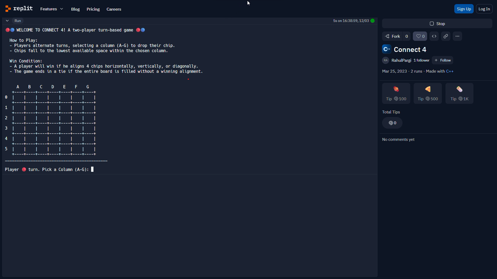
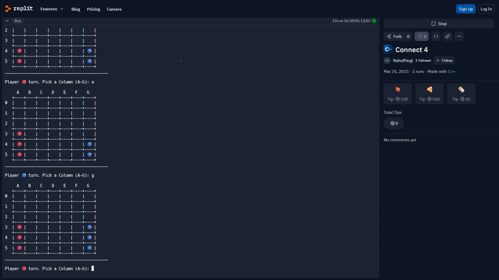
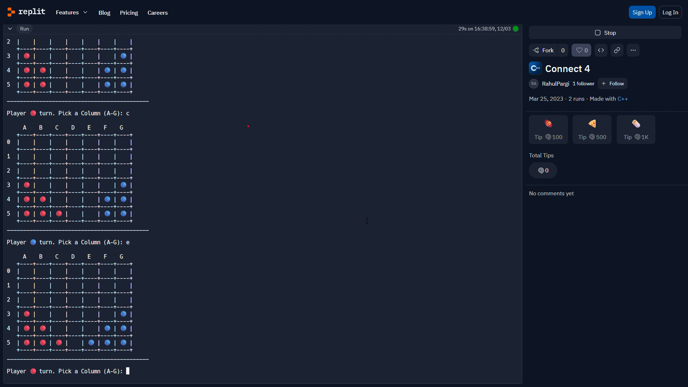
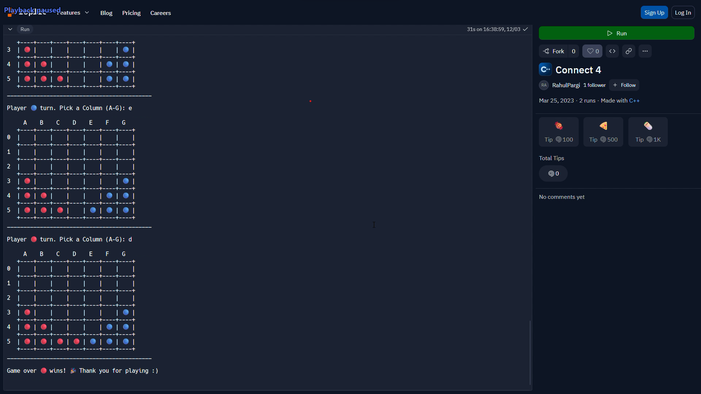
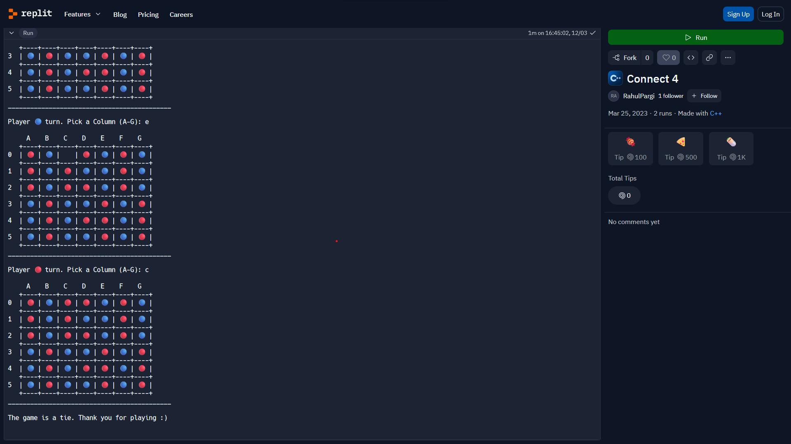

# Connect-4

### Introduction
    Connect 4 a classic two-player, turn-based game where strategic thinking and quick decisions are key to
    victory. In this game, players take turns dropping their chips into a vertical grid, aiming to connect 
    four of their chips either horizontally, vertically, or diagonally.
    
### Features
    - Dynamic turn-based gameplay with strategic chip placement.
    - Interactive game board allowing players to drop chips into columns (A-G).
    - Clear win conditions: align four chips horizontally, vertically, or diagonally.
    - Tie resolution when the entire board is filled without a winning alignment.
    
### Screenshots
   
   
   
   
   

   
### Implementation:
    To organize the code, C++ and OOP concepts have been employed. The implementation is divided into multiple files:
    
    - GameBoard:
        - Manages the game board, initializes the board and column information.
        - Prints the current state of the game board.
        - Tracks chip placement and checks for winning alignments.

    - GameManager:
        - Controls the game flow, including player turns, input validation, and win/tie conditions.
        - Utilizes the GameBoard class for managing the game state.

### Gameplay Demonstration
    - For a visual demonstration of the gameplay, watch video on YouTube.
[Youtube video link](https://youtu.be/Vb-V8l2GoUQ)

### Play the Game
    - To experience the game firsthand, play it directly by following this repl link.
[Repl link](https://replit.com/@RahulPargi/Connect-4)
